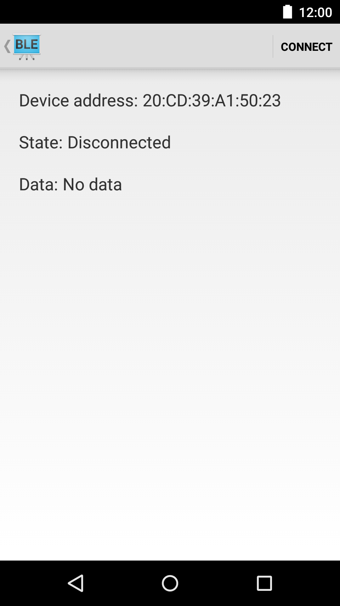

Android BluetoothLeGatt + MQTT 
===================================

This aplication uses Android example BLE and integrates with MQTT. It receives data over BLE and publishes it
to a MQTT hardcoded broker.

Screenshots
-------------

  
